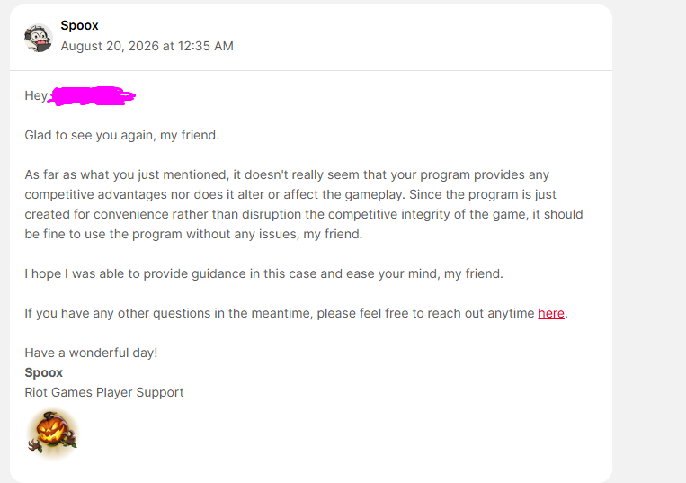
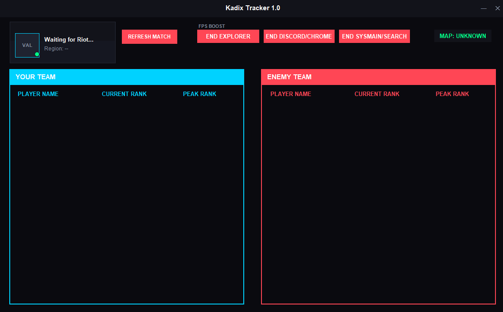

# Lite VALORANT Tracker

A very lightweight **VALORANT tracker** designed to use around **40 MB of RAM**, making it suitable for low-end computers.

## Features

* 🪶 Very lightweight and low RAM usage
* 📊 VALORANT player tracking
* 🏆 Rank and RR information
* 👥 Team and enemy information
* 🗺️ Current match/map information
* ⚡ Fast and simple
* 🖥️ Designed for low-end computers

## Requirements

* Windows
* VALORANT installed
* Riot Client running

## Download

Download the latest version from the **Download** folder/release.

## Screenshots

## Disclaimer

This is a small personal project and may contain bugs.

The tracker is designed to provide information without modifying gameplay or giving a competitive advantage.

Use it at your own risk and always keep your VALORANT and Riot Client installations up to date.

**Good Luck ♥**
